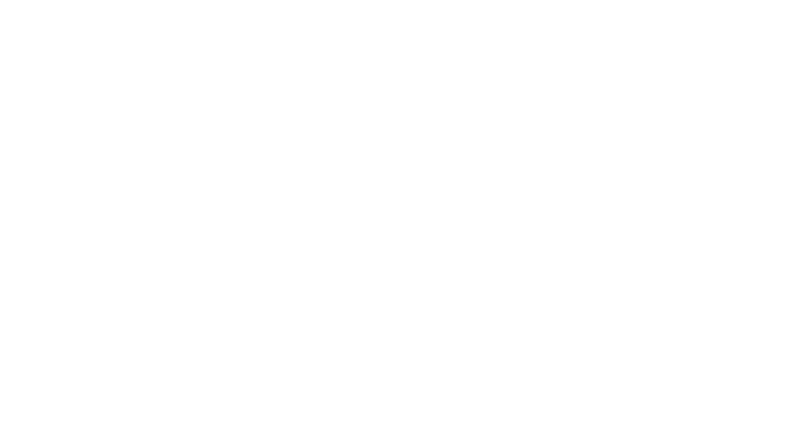
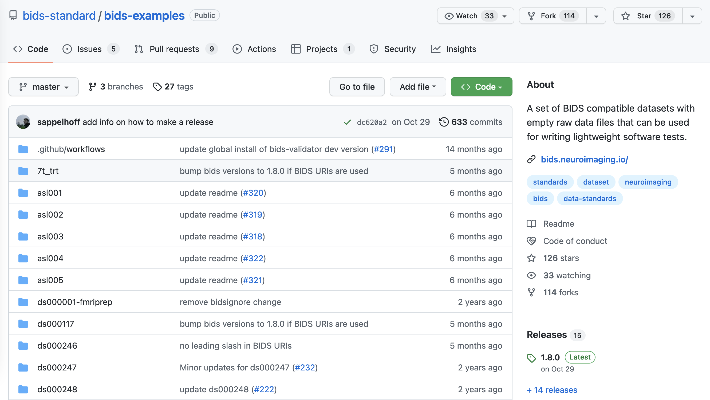
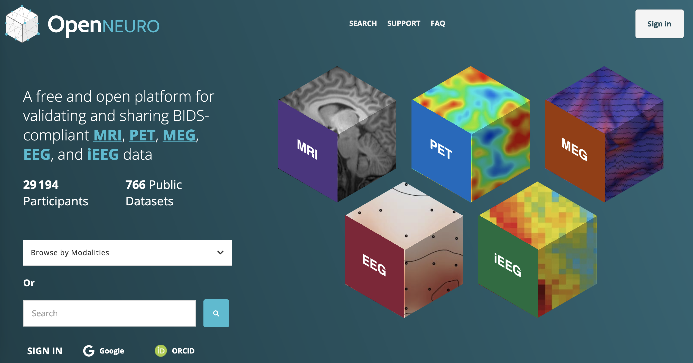
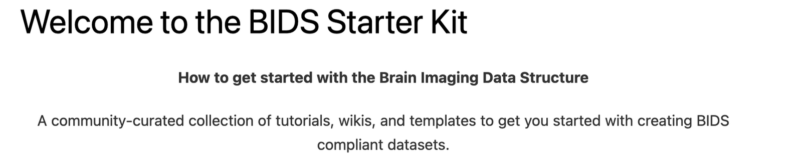
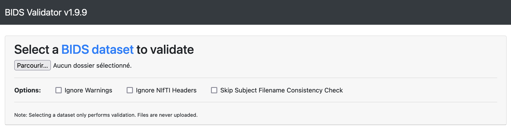

# <!--fit--> A 10-minute primer to BIDS

An introduction to the Brain Imaging Data Structure for busy engineers.

---

## Learning objectives

- Understand what BIDS is
- Introduce the core concepts
- Overview of available tools

---

# The Brain Imaging Data Structure

---

## Definition

> A *simple* and *intuitive* way to **organize** and **describe** your neuroimaging and behavioral data.

---
<!-- _class: invert -->

> The Brain Imaging Data Structure (BIDS) is a standard specifying the description of neuroimaging data in a filesystem hierarchy and of the metadata associated with the imaging data.



---

## Governance

BIDS is a [community-driven][bids-get-involved] effort.

The [specification][bids-specification] is opensource and contributions are accepted through submission of issues and requests to the GitHub [repository][bids-repository].

Governance is driven by a formal [leadership structure][bids-governance], which ensures strict application of contribution policies and the [code of conduct][bids-coc].

[bids-get-involved]: https://bids.neuroimaging.io/get_involved.html
[bids-specification]: https://bids-specification.readthedocs.io
[bids-repository]: https://github.com/bids-standard/bids-specification
[bids-governance]: https://bids.neuroimaging.io/governance.html
[bids-coc]: https://github.com/bids-standard/bids-specification/blob/master/CODE_OF_CONDUCT.md

---

## Extensions

Requests for improvement are handled through [BIDS Extension Proposals][bep] (BEP).

BEPs are incubated within special interest groups, prior to proposal for inclusion to the specification.

Once accepted, the BEP is officially included in the next release of the specification.

Notable BEPs: [EEG][bep006], [MEG][bep008], [PET][bep009], [Microscopy][bep031]
WIP: [DWI derivatives][bep016], [PET derivatives][bep023], [Provenance][bep028]

[bep]: https://docs.google.com/document/d/1pWmEEY-1-WuwBPNy5tDAxVJYQ9Een4hZJM06tQZg8X4/edit
[bep006]: https://bids.neuroimaging.io/bep006
[bep008]: https://bids.neuroimaging.io/bep008
[bep009]: https://bids.neuroimaging.io/bep009
[bep016]: https://bids.neuroimaging.io/bep016
[bep023]: https://bids.neuroimaging.io/bep023
[bep028]: https://bids.neuroimaging.io/bep028
[bep031]: https://bids.neuroimaging.io/bep031

---

# Concepts

- Datasets
- File collections
- Metadata

---

## Datasets

- Source, raw and derivative datasets
- Minimal requirements
- Storage convention

---

### Types of dataset

Raw dataset

- A BIDS-compliant dataset containing the raw data of the study.

Source dataset

- A non BIDS-compliant dataset containing the source data of the study before normalisation to BIDS.

Derivative dataset

- A BIDS-like dataset containing artifacts processed from a raw dataset and other derivatives possibly.

---

### Minimal requirements

[dataset_description.json][bids-dataset-description]

```json
{
    "Name": "This dataset",
    "BIDSVersion": "1.8.0",
    "DatasetType": "raw" | "derivative",
}
```

[bids-dataset-description]: https://bids-specification.readthedocs.io/en/stable/03-modality-agnostic-files.html#dataset_descriptionjson

---

### Storage convention (1)

Embedded (in-tree)

```
rawdata/
    dataset_description.json
    derivatives/
        pipeline-foo/
            dataset_description.json
       pipeline-bar/
            dataset_description.json 
    sourcedata/
```    

---

### Storage convention (2)

Standalone (out-of-tree)

```
sourcedata/
rawdata/
    dataset_description.json
derivatives/
    pipeline-foo/
        dataset_description.json
    pipeline-bar/
        dataset_description.json
```

---

## File collections

- BIDS file naming convention
- Components and entities
- Derivatives

---

### Anatomy of a BIDS file

```
sub-P01/
    ses-M00/
        anat/
            sub-P01_ses-M00_T1w.nii.gz
```

---

### Components and entities

```
sub-P01/
    ses-M00/
        anat/
            sub-P01_ses-M00_run-01_T1w.nii.gz
            sub-P01_ses-M00_run-02_T1w.nii.gz
```

Entities: `sub`, `ses`, `run`
Datatype: `anat`
Suffix: `T1w`
Extension: `.nii.gz`

[Supported entities](bids-entity-table) by modality.

[bids-entity-table]: https://bids-specification.readthedocs.io/en/stable/appendices/entity-table.html

---

### Anatomy of a derivative

```
sub-P01/
    ses-M00/
        anat/
            sub-P01_ses-M00_desc-preproc_T1w.nii.gz
```

Source entities: `sub`, `ses`
Derivative entities: `desc`

[BIDS derivatives][bids-derivatives] are still a work-in-progress. Consider checking for in-progress [BEP][bep] first, before reaching for your own implementation.

[bids-derivatives]: https://bids-specification.readthedocs.io/en/stable/05-derivatives/01-introduction.html#bids-derivatives

---

## Metadata

- Modality-specific metadata
- Modality-agnostic metadata
- The inheritence principle

---

### Modality-agnostic metadata

[Modality-agnostic][bids-modality-agnostic] metadata are defined in tabular format and serialised to TSV.

```
participants.tsv                        # participant-level metadata
sub-P01/
    sub-P01_sessions.tsv                # session-level metadata
    ses-M00/
        sub-P01_ses-M00_scans.tsv       # scan-level metadata
```

Example: participants.tsv

| participant_id | age | sex | handedness | group |
|:- | - | - | - | - |
| sub-P01 | 36 | M | n/a | control

[bids-modality-agnostic]: https://bids-specification.readthedocs.io/en/stable/03-modality-agnostic-files.html

---

### Modality-specific metadata

[Modality-specific][bids-modality-specific] metadata are defined in dictionary format and serialised to JSON.

```
sub-P01/
    ses-M00/
        anat/
            sub-P01_ses-M00_T1w.nii.gz
            sub-P01_ses-M00_T1w.json    # Modality-specific metadata
```

Example sidecar JSON metadata:

```json
{
    "MagneticFieldStrength": 3,         /* DICOM tag 0018, 0087 */
    "MRAcquisitionType": "3D",          /* DICOM tag 0018, 0023 */
    "EchoTime": 0.00298                 /* DICOM tag 0018, 0081 */
}
```

[bids-modality-specific]: https://bids-specification.readthedocs.io/en/stable/04-modality-specific-files

---

### Metadata inheritence

:warning: *OPTIONAL*

```
T1w.json                                # Dataset-wide definition
sub-P01/
    sub-P01_T1w.json                    # Participant-specific overrides
    ses-M00/
        anat/
            sub-P01_T1w.nii.gz
            sub-P01_T1w.json            # Modality-specific overrides
```

Modality-specific metadata computed by dictionary merging from top to bottom.

[bids-inheritence]: https://bids-specification.readthedocs.io/en/stable/02-common-principles.html#the-inheritance-principle

---

# Ecosystem around BIDS

- Publicly available datasets
- Official tools and libraries
- Third-party implementation

---



---



---



---



---

## Official libraries

- [PyBIDS][pybids]
- [BIDS-MATLAB][bids-matlab]

[pybids]: https://bids-standard.github.io/pybids/
[bids-matlab]: https://bids-matlab.readthedocs.io/

---

## Converters

- [dcm2niix: DICOM to NIfTI converter][dcm2niix]
- [HeuDiConv: heuristic-centric DICOM converter][heudiconv]
- [Clinica: software platform for clinical neuroimaging studies][clinica]

among [others][bids-converters]

[dcm2niix]: https://github.com/rordenlab/dcm2niix
[heudiconv]: https://heudiconv.readthedocs.io/
[clinica]: https://aramislab.paris.inria.fr/clinica/docs/public/latest/
[bids-converters]: https://bids.neuroimaging.io/benefits.html#converters

---

## Third-party libraries

- [ancpbids] (raw and derivative datasets r/w)
- [mne-bids] (focused on EEG and MEG)
- [bidscoin] (schema-based conversion)

[ancpbids]: https://ancpbids.readthedocs.io/
[mne-bids]: https://mne.tools/mne-bids/
[bidscoin]: https://bidscoin.readthedocs.io/

---

# Questions

Thank you for your attention.
